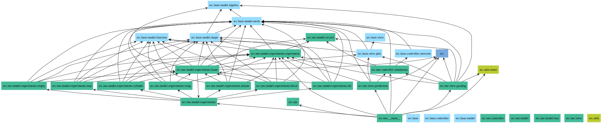

```text
                   _   _______ ______
    ____  __ ___  / | / / ___// ____/
   / __ \/ / __ \/  |/ /\__ \/ __/   
  / /_/ / / / / / /|  /___/ / /___   
 / .___/_/_/ /_/_/ |_//____/_____/   
/_/                                  
```

[](https://github.com/s9latimm/pinnse/actions/workflows/master.yml)
[](https://github.com/s9latimm/pinnse/actions/workflows/delevop.yml)

[](https://github.com/s9latimm/pinnse/releases/latest/download/packages.pdf)

[](https://github.com/s9latimm/pinnse/releases/latest/download/classes.pdf)


## Setup

### Virtual Environment

#### Windows (Powershell)

```shell
$ python -m venv .venv
$ .\.activate.ps1
```


#### Linux

```shell
$ python -m venv .venv
$ source ./venv/bin/activate
```

### Dependencies

```shell
$ python -m pip install --upgrade pip
$ python -m pip install wheel
$ python -m pip install torch --index-url https://download.pytorch.org/whl/cu124
$ python -m pip install -r requirements.txt
```

## Usage

- [Wikipedia](https://en.wikipedia.org/wiki/Navier%E2%80%93Stokes_equations#Incompressible_flow)

```text
usage: nse [-h] -e {empty,step,slalom,block,slit,cylinder,wing} [-i <intake>] [-n <nu>] [-r <rho>] [--id <id>] [-N <train>] [-L <layers>] [-d {cpu,cuda}] [--supervised] [-p] [-F] [-G] [-R]

options:
  -h, --help            show this help message and exit
  -L <layers>           size of layers seperated by colon (default: 100:100:100)

initialization:
  -e {empty,step,slalom,block,slit,cylinder,wing}
                        choose experiment
  -i <intake>           set intake [m/s] (default: 1.0)
  -n <nu>               set viscosity [m^2/s] (default: 0.1)
  -r <rho>              set density [kg/m^2] (default: 1.0)

optimization:
  --id <id>             identifier / prefix for output directory (default: timestamp, example: 2024-10-20_16-16-36)
  -N <train>            number of optimization steps (default: 0)
  -d {cpu,cuda}         device used for training (default: cpu)
  --supervised          set training method to supervised approach (requires -F)

output:
  -p                    plot NSE in output directory
  -F                    initialize OpenFOAM experiment
  -G                    grade prediction (requires -pF)
  -R                    plot NSE with high resolution grid in output directory (requires -p)
```

#### Examples

```shell
$ python -m src.nse -e step -i 5 -n .08 -N 100
```

```shell
$ python -m src.nse -e wing --id wing -L 100:100:100:100 -i 1 -n .01 -d cuda -pRFGN 30000
```

```shell
$ python -m src.nse -e block
```

## References

- [Raissi, M. et al.: Physics Informed Deep Learning (Part II)](https://arxiv.org/pdf/1711.10566)
