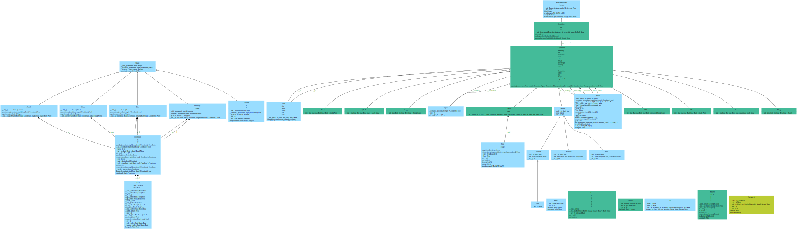

# pinNSE

[](https://github.com/s9latimm/inf-mp-aos/actions/workflows/master.yml)
[](https://github.com/s9latimm/inf-mp-aos/actions/workflows/delevop.yml)

```text
                   _   _______ ______
    ____  __ ___  / | / / ___// ____/
   / __ \/ / __ \/  |/ /\__ \/ __/   
  / /_/ / / / / / /|  /___/ / /___   
 / .___/_/_/ /_/_/ |_//____/_____/   
/_/                                  
```

[](https://github.com/s9latimm/inf-mp-aos/releases/latest/download/classes.pdf)

## Setup

### Virtual Environment

#### Windows (Powershell)

```shell
$ python -m venv .venv
$ .\.activate.ps1
```


#### Linux

```shell
$ python -m venv .venv
$ source ./venv/bin/activate
```

### Dependencies

```shell
$ python -m pip install --upgrade pip
$ python -m pip install wheel
$ python -m pip install torch --index-url https://download.pytorch.org/whl/cu124
$ python -m pip install -r requirements.txt
```

## Tools

### Navier-Stokes Equation

- [Wikipedia](https://en.wikipedia.org/wiki/Navier%E2%80%93Stokes_equations#Incompressible_flow)

```text
usage: nse [-h] -e {empty,step,curve,expand,slalom,block,cylinder,wing,slit} [-i <intake>] [--nu <nu>] [--rho <rho>] [--id <id>] [-n <train>] [-l <layers>] [-d {cpu,cuda}] [-f] [--supervised] [-p] [-r] [--save]

options:
  -h, --help            show this help message and exit
  -l <layers>, --layers <layers>
                        size of layers seperated by colon (default: 100:100:100)

initialization:
  -e {empty,step,curve,expand,slalom,block,cylinder,wing,slit}, --experiment {empty,step,curve,expand,slalom,block,cylinder,wing,slit}
                        choose experiment
  -i <intake>, --intake <intake>
                        set intake [m/s] (default: 1.0)
  --nu <nu>             set viscosity [m^2/s] (default: 0.01)
  --rho <rho>           set density [kg/m^2] (default: 1.0)

optimization:
  --id <id>             identifier / prefix for output directory (default: timestamp, example: 2024-10-13_15-31-32)
  -n <train>, --train <train>
                        number of optimization steps (default: 1)
  -d {cpu,cuda}, --device {cpu,cuda}
                        device used for training (default: cpu)
  -f, --foam            load OpenFOAM
  --supervised          set training method to supervised approach (requires --foam)

output:
  -p, --plot            plot NSE in output directory
  -r, --hires           plot NSE with high resolution grid in output directory (requires --plot)
  --save                store model parameters in output directory
```

#### Examples

```shell
$ python -m src.nse --experiment step -intake 5 --nu .08 --train 100
```

```shell
$ python -m src.nse -e wing --id wing -l 100:100:100:100 -i 1 --nu .01 -d cuda -rpfn 30000
```

```shell
$ python -m src.nse -e block
```

### Burgers' Equation

- [Wikipedia](https://en.wikipedia.org/wiki/Burgers%27_equation)

TODO

## References

- [Raissi, M. et al.: Physics Informed Deep Learning (Part II)](https://arxiv.org/pdf/1711.10566)
